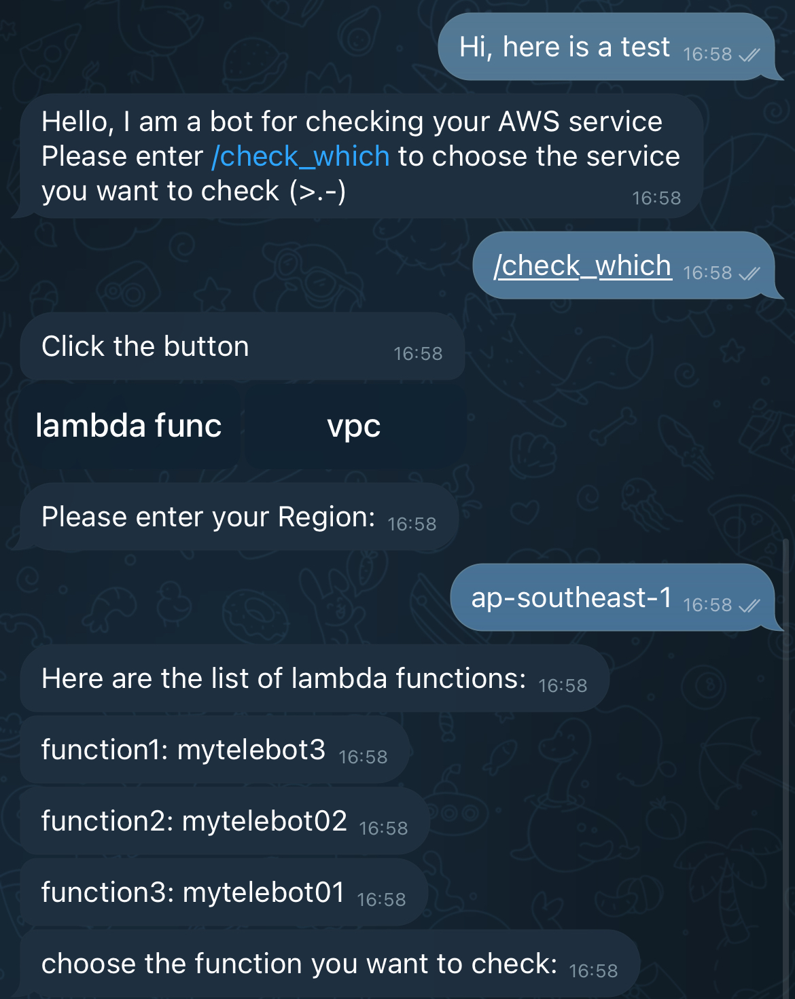
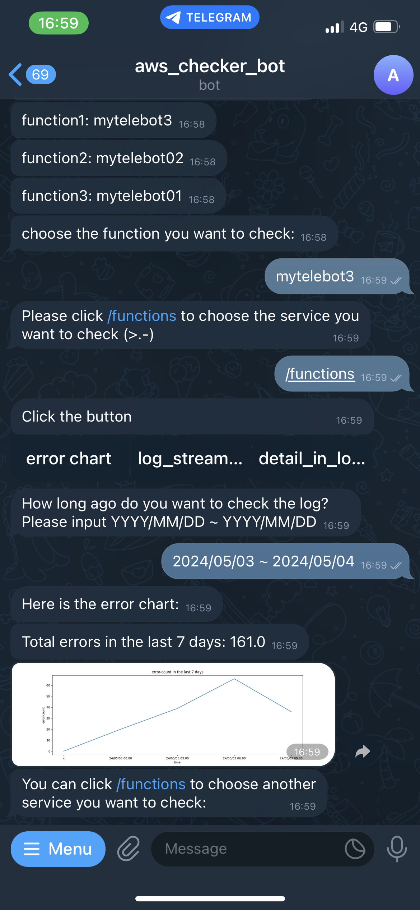
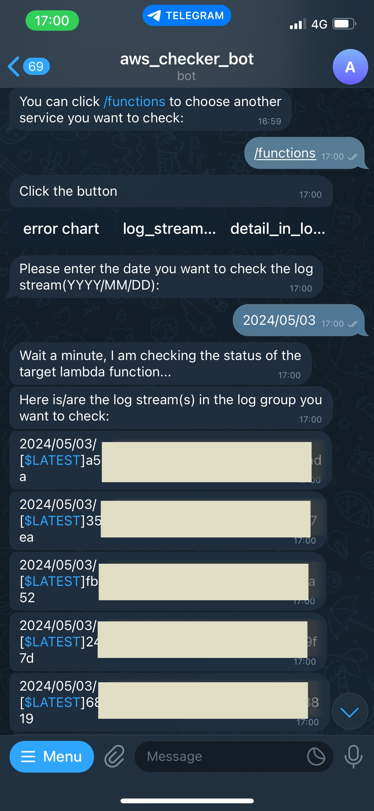
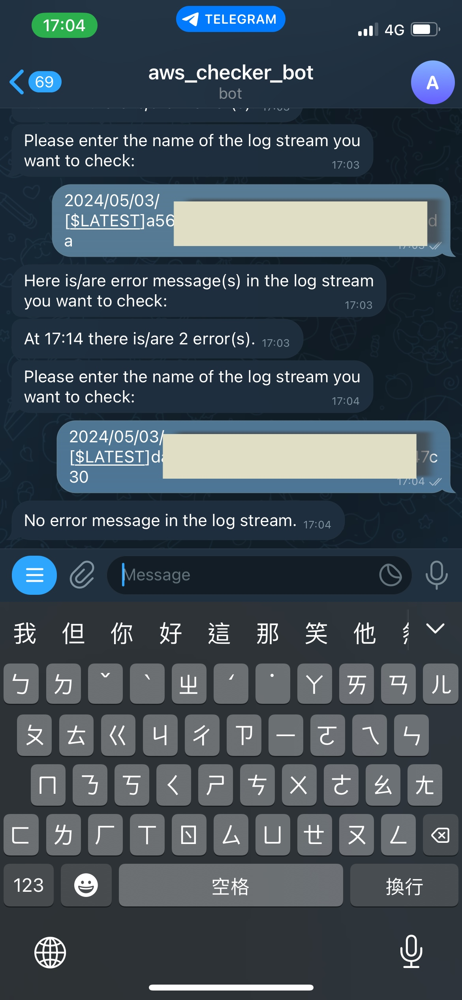

# AWS_Checker_TeleBot
This is a simple Telegram Bot for checking the status of AWS Services. The current version can let you use for checking status of your own Lambda Functions. In the future, it will be able to check VPC, EC2 and so on, or even support more users.

The purpose of building this bot is to let me know more about the AWS services. If you are loooking for how to build your TeleBot with multiple functions, this project might give you some ideas. If you are a begginer, [this](https://github.com/ki225/telegram_bot_with_AWS_for_beginner.git) might suit for you.


## Screenshots
Here are the screenshots of using this bot.

   

## How to set your own checker bot with this repo?
1. Create your Telegram Bot by asking Bot Father
2. Fill the TeleBot TOKEN in the python file
3. Create an EC2
4. Connect your local host to the EC2 with SSH
5. Put the python file into your EC2 host
    The path I set the python file is in the directory `/home/ec2-user/checker_bot`. 
6. Prepare all the package you need
    In the EC2 you have created, it is a whole new environment without the resources you need. First, we need the "pip" package. If you remember that you downloaded it before, you can check it by using `pip --version` first.
    ```
    sudo yum upgrade
    sudo yum -y install python-pip
    ```
    Then we can download the packages we need for the python file with "pip install" command.
    ```
    pip install telebot
    pip install boto3
    pip install matplotlib
    ```
    You can run the python code with "python checker_bot.py" to check whether all the packages are set completely.

7. Let the bot know WHO YOU ARE
    You have to set the "AWS configuration" with your AWS access key, secret access key and region. Use the command below for setting. Otherwise, the bot will not catch the information for you like the following screenshot.
  
    
  
    Use SSH to connect to the EC2 host in your terminal.
    ```
    ssh -i <THE_PATH_TO_YOUR_KEY.pem> ec2-user@<YOUR_EC2_Public_IPv4_DNS>
    ```
    You will see this after you connect successfully.
    ```
       ,     #_
       ~\_  ####_        Amazon Linux 2023
      ~~  \_#####\
      ~~     \###|
      ~~       \#/ ___   https://aws.amazon.com/linux/amazon-linux-2023
       ~~       V~' '->
        ~~~         /
          ~~._.   _/
             _/ _/
           _/m/'
    ```
    Edit the configuration file.
    ```
    aws configure
    ```
    The following lines will show seperately.
    ```
    AWS Access Key ID [None]:
    AWS Secret Access Key [None]:
    Default region name [None]:
    Default output format [None]:
    ```

8. Use "nohup"
    For serving consistently, the python code have to keep running for getting user message no matter whether the EC2 console is open. 
    ```
    nohup python3 checker_bot.py
    ```
    If you set some check point or error handler like try/except, you can check them from "nohup.out" with the command below.
    ```
    tail -f nohup.out
    ``` 
9. Congrat!

## Handler
Values of the global variable "HANDLER" represent the next input will give to which function. 
- 0 : Start of this bot, just give some hint for the user.
- 1x : Check for Lambda Function
- 2x : Check for VPC
- x0 : choose the target one from all of your Lambda Functions or VPCs
- x1 : Choose the service by clicking buttons
- x2 : Count the numbers of error from CLoudWatch and Draw the error chart
- x3 : Get all log streams in the target log group
- x4 : Get detail in the target stream

### CLoudWatch
If you want your TeleBot give you more information, you can grab the data from CLoudWatch. I use the data from CLoudWatch for counting how many errors happened in my Lambda Function.


You have to use the function `get_metric_data` for getting the data. Here are the documents you might need:
- [get_metric_statistics](https://boto3.amazonaws.com/v1/documentation/api/latest/reference/services/cloudwatch/client/get_metric_statistics.html)
- [get_metric_data](https://boto3.amazonaws.com/v1/documentation/api/latest/reference/services/cloudwatch/client/get_metric_data.html)

The document clearly explain all the parameters in this function. You can find the value corresponding to the parameter like below:


